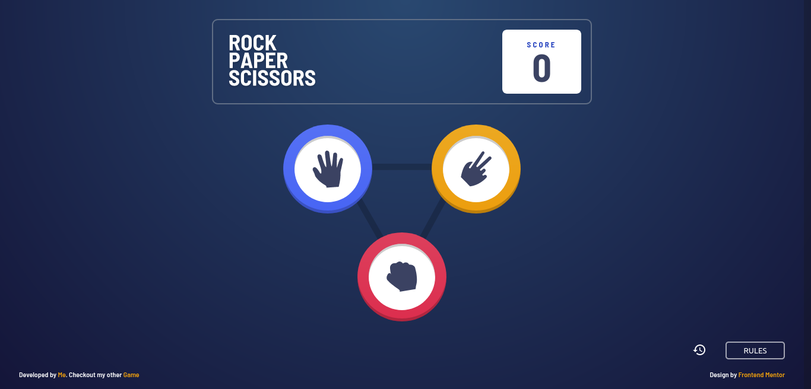
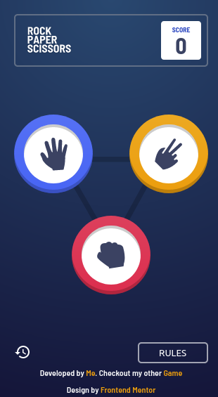

# Rock, Paper, Scissors made by [Me](https://www.github.com/vshal-ch)

## Table of contents

- [Overview](#overview)
  - [The challenge](#the-requirements)
  - [Screenshot](#desktop-screenshot)
  - [Links](#links)
  - [Built with](#built-with)
## Overview

### The requirements

Users should be able to:

- View the optimal layout for the game depending on their device's screen size
- Play Rock, Paper, Scissors against the computer
- Maintain the state of the score after refreshing the browser

### Desktop Screenshot

### Mobile Screenshot

### Links

- Live Site URL: [Rock, Paper, Scissors](https://vshal-ch.github.io/Rock-paper-scissors)
- My other game URL: [Memory game with emojis](https://vshal-ch.github.io/Memory_Game-with-emojis)

### Built with

- Semantic HTML5 markup
- CSS custom properties
- Flexbox
- CSS Grid
- Mobile-first workflow
- JavaScript
